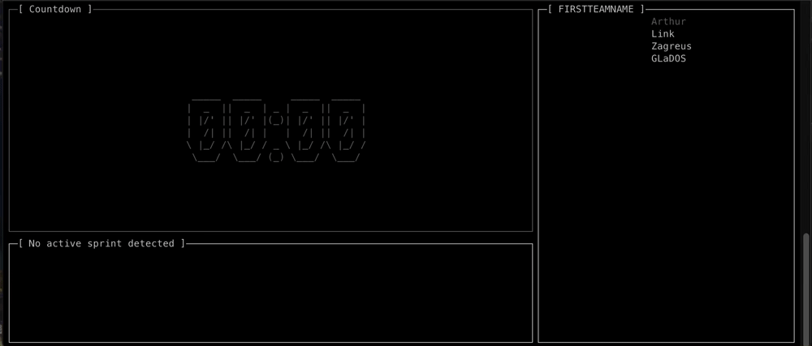
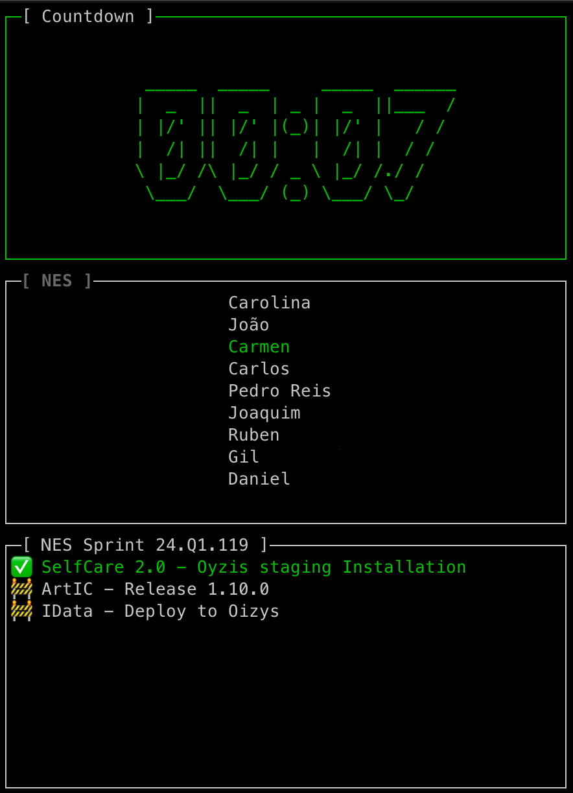

# ScrumChrono

  <a href="#about">About</a> •
  <a href="#features">Features</a> •
  <a href="#built-with">Built With</a> •

---

## About

ScrumChrono is a terminal UI to aid Scrum meetings. The goal of this project is to make easy to track time and provide some extra information.
Feel free to open an issue with any bug you encounter of any suggestion.

As of now this is available to install via [brew](https://github.com/pedrojreis/homebrew-ScrumChrono).

## Features

* Config your teams by members, time and font.
* Countdown will change color when 33%, 66% and 100% of time has elapsed.
* Pause
* Atlassian Integration
* Soon: Statistics

  

## Built With

* [Go 1.21.7](https://go.dev/dl/) - Framework
    * [Cobra](https://github.com/spf13/cobra) - lib to create cli app
    * [Viper](https://github.com/spf13/viper) - configuration solution
    * [Termui](https://github.com/gizak/termui) - terminal dashboard and widget library
    * [Go-Figure](https://github.com/common-nighthawk/go-figure) - beautiful ASCII
* ❤️
